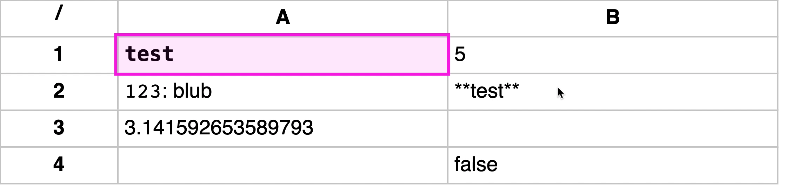
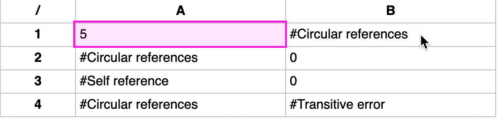

# Spreadsheets 📈

Spreadsheets is a small simple (**WIP**) spreadsheet application web app thingy.


<center style="color: dark-grey; font-size: 12px">Basic functionality</center>


<center style="color: dark-grey; font-size: 12px">Error handling</center>

## Features

- Excel-like formulas
- Markdown support
- more coming soon™

## Installation

```
git clone https://github.com/JannikWibker/spreadsheets
cd spreadsheets
npm install
npm start
```

## Development

The project was created using [Create React App](https://github.com/facebook/create-react-app). For transpiling, building etc. related things the Create React App documention can be used.

The project is roughly split into the following folders
- components: every react component that is not the root component (the root component is located in App.js)
- css
- util: useful utilities, parsers and everything that does not really belong together with react components
- public: static resources like the index.html file and manifest.json

A file format for spreadsheet files exists which is pretty much just json and some extra bits. An example can be found in the `example-spreadsheet-file.txt`. What file extension such files should have is something which still needs to be decided. It shouldn't be too long and also shouldn't clash with existing ones. Just using .bin, .txt or similar is also an option. For now .txt is used until some decision is made.